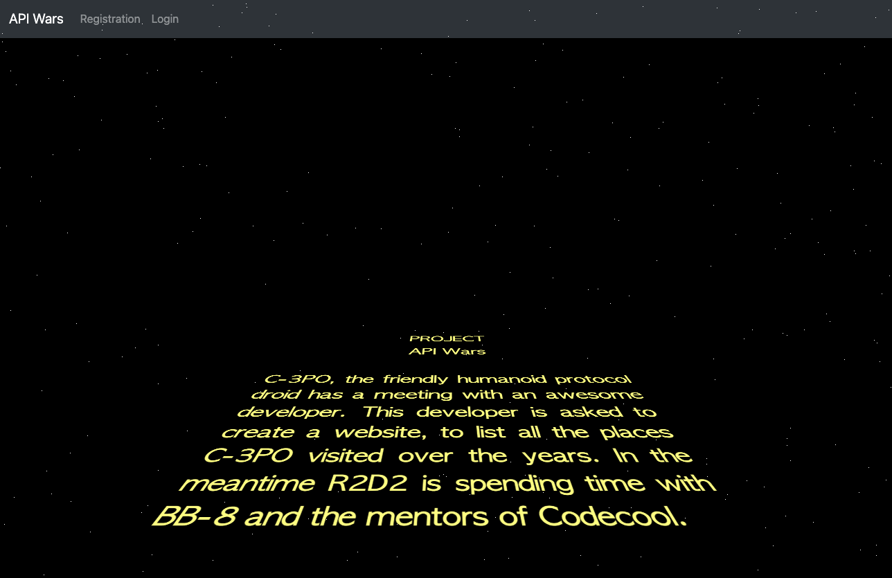
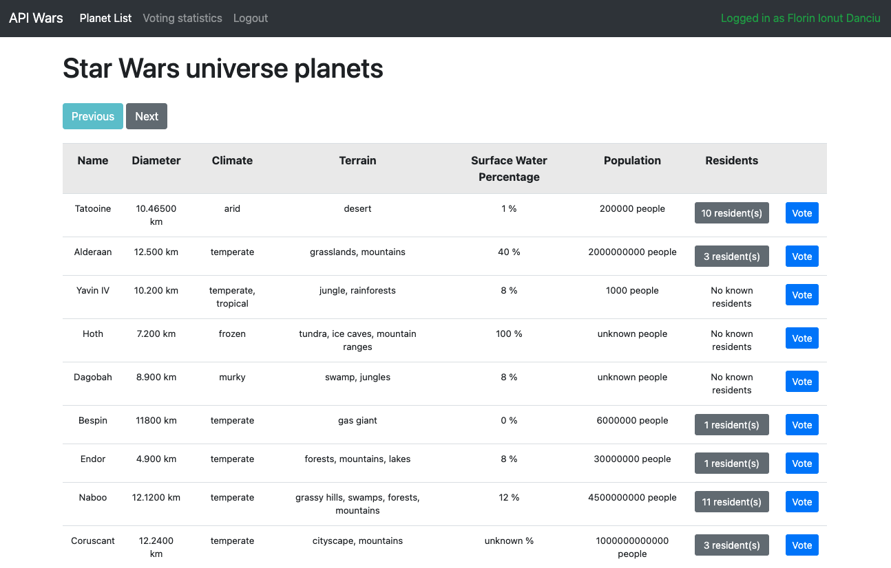
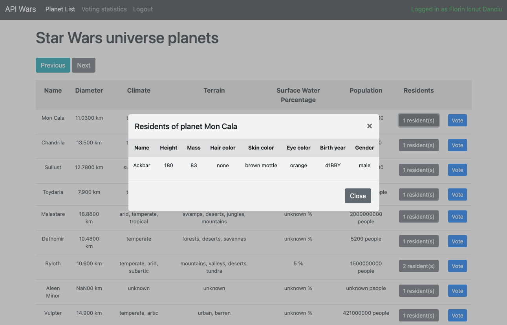

# API Wars

## Story

Because you are so awesome, a golden humanoid droid want to meet you in the
nearest Kantina....

Your task is to create a little web application which shows data about the Star
Wars universe, store visitor preferences with cookies and handle user login with
sessions.

## What are you going to learn?

- create a Flask project,
- use routes with Flask,
- use Bootstrap,
- use AJAX for API requests,
- session handling,
- simple queries in SQL,
- password storage.

## Tasks

1. Create a web server rendering a page that shows a table with all the planets in the Star Wars universe.
    - The opening page of the website (`/`) shows data of 10 planets
    - The page has an HTML `<table>` element containing the data
    - The columns of the table are `name`, `diameter` (shown in km), `climate`, `terrain`, `surface water` (shown as percentage), `population` (formatted as `1,000,000 people`)
    - The column titles are proper table headers
    - There's a next button above the table, clicking that shows the next 10 planets, if any
    - There's a previous button above the table, clicking that shows the previous 10 planets, if any
    - Double clicking on the next or previous buttons shows the next/previous 10 planets only once

2. Display a button in each row if the planet has residents. These buttons should open a modal, populate its data containing the list of residents with more detailed information.
    - In the planet table there is a button in each row in a new column showing the planet's number of residents if the planet has any, otherwise the `No known residents` text is shown
    - Clicking the `<n> residents` button in the planet table, a modal shows up showing all the residents of that planet (every time)
    - The modal has an HTML `<table>` element containing the data
    - The columns of the table are `name`, `height` (shown in meters), `mass` (shown in kg), `skin color`, `hair color`, `eye color`, `birth year`, `gender` (an icon representation)
    - Data is loaded into the table without page refresh (with AJAX)
    - There is an X icon in the top right corner and a `Close` button in the bottom right corner; clicking these closes the modal

3. Create a simple user login system with registration page, login page and logout link in the header.
    - There is a link in the header that leads to the registration page
    - On the registration page (`/register` route) the visitor can create a username/password pair that gets stored in the database
    - Password storage and retrieval uses salted password hashing for maximum security
    - If either field is empty while clicking on the `Submit` button on the registration page the `Please, fill in both fields.` error message appears
    - If the username field contains a username that already exists in the database while clicking on the `Submit` button on the registration page the `Username already exists, please choose another one!` error message appears
    - On successful registration the `Successful registration. Log in to continue.` text is shown and the user is redirected to the login page
    - On the login page (`/login` route) the visitor can log in using the username/password previously created during registration
    - If the username/password pair doesn't match while clicking on the `Submit` button on the login page the `Wrong username or password.` error message appears
    - After logging in, the username is displayed in the top right corner with the text `Signed in as <username>` and a logout link is shown in the header
    - Clicking the logout link (`/logout` route) logs the user out

## General requirements

- For the whole assignment, get the data using [The Star Wars API](https://swapi.dev/)
